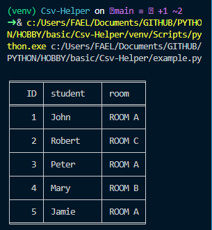
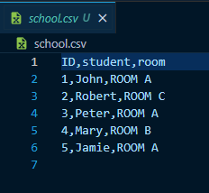

<h1>Csv-Helper</h1>

<p>Uma classe python para manipular csv, o código da classe está no arquivo main.py. Este projeto foi escrito em março de 2021</p>

<h2>Exemplo de uso</h2>

<h3>Código ( example.py )</h3>

```
from main import CsvHelper


csv = CsvHelper('school')

csv.create(['student', 'room'])

csv.fill_one(['John', 'ROOM A'])

csv.fill_many([
    ['David', 'ROOM B'],
    ['Peter', 'ROOM A'],
])

names = ['Mary', 'Jamie']
rooms = ['ROOM B', 'ROOM A']

csv.fill_by_columns(names, rooms)

csv.del_line(2)

csv.insert_data(2, ['Robert', 'ROOM C'])

csv.view()

```


<h3>Resultado no ternimal</h3>


<h3>Resultado ( school.csv )</h3>

